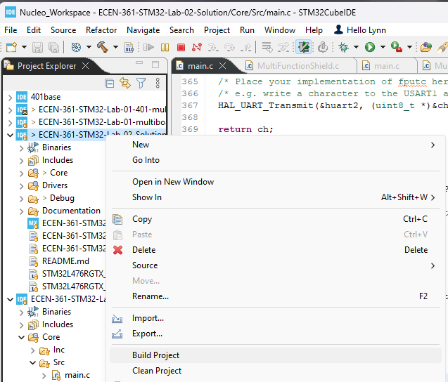
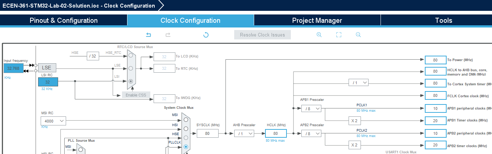
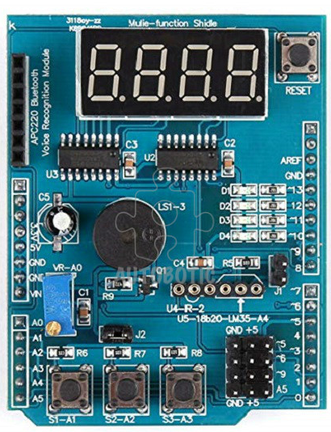

# ECEN-361 Lab-02: Clocks, Timers, and Interrupts

     Student Name:  Fill-in HERE

## Introduction and Objective of the Lab

The objectives of this lab are as follows:

- Part 1: Load the LED-D1 Blinky working with a simple timer-based interrupt. Add two more timers to blink LED_D2 and LED_D3 with differing rates.

- Part 2: Reconfigure the timer clock to see the effects of changing the clock source and parameters.

- Part 3: Use a built-in timer to count the time of an external event (button push). This will be done with a fun Reaction timer.

For each of the parts, follow the instructions, then fill in answers to the questions. Expected answers are indicated in brackets like this: \[*answer here*]. Replace the bracketed text with your answer.

The submission for this lab is simply the repository that you’ll modify. Your modifications get pushed back to github.com. Your responses, as recorded in this file, will be checked along with your running project.

## Part 1: Adding LEDs to Blinky Application

1. Import with File/Import and point to the directory of the newly cloned project

2. Clean and build the project:



        There should be no errors or warnings.

3. Run the project.
   
   * The project should simply blink the D1_LED once per second.
   
   * No seven-segment display.

### Add 2 more timer interrupts that blink LEDs

* D2_LED: Once every 500 mS.

* D3_LED: Once every 250 mS.

Do this by using the GUI (click on the MX -- .ioc file). Note that two of the timers are already taken:

- DON’T USE TIM17 – it’s dedicated to displaying the seven-segment lights
- DON’T’USE TIM16 – Note that it’s doing D1 at 1 second.

Note that a few things have to happen to make a timer-based interrupt work:

1. The interrupt **must** be enabled in the NVIC settings in the configuration.

2. Timer has to be initialized (this code is generated by the GUI – see   
   **MX_TIM17_Init();**

3. Timer has to be started – You put this in main.c see:   
   **HAL_TIM_Base_Start_IT(&htim17);**

4. ISR has to be defined -- You put this in main.c see:
   
   **HAL_TIM_PeriodElapsedCallback(TIM_HandleTypeDef \*htim)**

**Safety tip:**
Note that with the GUI-generated source-codes, anything the USER (you) change that is NOT between the comment sections indicators:

```c
    /* USER CODE BEGIN x*/
    /* USER CODE END   x */
```
can be **ERASED**.

Any modifications you make should *ALWAYS* between these section headers.

## Part 1 Questions (2 pts)

Note the speed of D1/D2/D3 – they should seem like a 3-bit binary counter.

Once you have all three LEDs blinking properly, answer the following questions:

1. How fast does D1 turn on/off? [*answer here*]

2. Do all LEDs toggle at *exactly* the same time? [*answer here*]

## Part 2: Changing the clock tree

Change the clock tree to adjust the rates at which the LEDs blink.

1. Open the ioc Configuration GUI
2. Change the APB1 and ABP2-Prescalers to “/8” (Changing both of them guarantees that whatever timer you chose will be affected.)



3. Compile and re-run and observe the behavior of the LEDs

## Part 2 Questions (3 pts)

1. What has happened to the speed of the timers? [*answer here*]

2. What is the new frequency of LED D1? [*answer here*]

3. When we changed the frequency, did the Seven-Segment Light update rate change?  (hint, look at the clocks driving the APB1, APB2 buses and which timers are on which bus.  Recall that the Seven-Segment timer is Tim17) [*answer here*]

## Part 3: Reaction Timer (5 pts)

In addition to performing useful tasks at set intervals, timers can also be used to measure elapsed time of an event. The events can be triggered by software, or by a hardware input.

For this part of the lab, we’ll make a small “reaction timer” that measures how fast your hand/eye coordination can be, in milliseconds.

We’ll define the buttons and display as shown:



* **START button (S1):** Initiates a random wait. After the random wait, all the SevenSeg lights go on. As soon as the lights go on, a timer starts counting milliseconds

* **STOP button (S2):** Stops the millisecond reaction timer and shows it on the display

* **FASTEST button (S3):** Extra Credit – This button shows the fastest speed.

Code for this part is organized in the **ReactionTester.c** source file and **main.c**. Fill in between the comments:

```c
/* Student Start HERE */

/* Student End HERE */
```

Read thru the comments in the code. Most of the structure is in place, and you should only have to modify places between Student_Start / Student_End.

Note that for the reaction timer to be accurate, because you changed the prescaler above in Part2, you’ll need to reset it back to the default of no-prescale, x1. 

## Extra-Credit (5pts maximum)

* In the current code, there’s no penalty for “Cheating” by pushing the stop button before all the “Go” lights turn on.  Implement some sort of indicator that the
  Stop button was pushed prematurely.

* Change the “Go” lights to be all of the D1..4 LEDs instead of display all ‘8888’ on the SevenSegments.

* Make the final reaction time flash on/off

If you do any of these items – just mention what and how it worked, [*here*].
